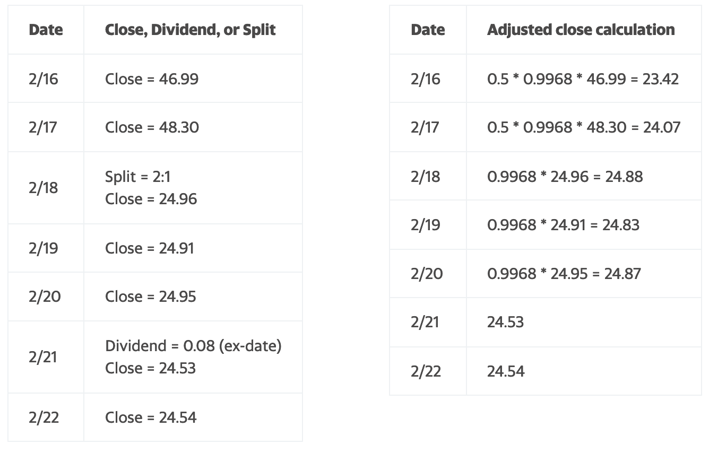

# 作業メモ

## 2024.4.25@丸の内スタバ

### 1minバーから、任意のタイムバーへ変換

`index`を`timeseries`にするのを失念しており、エラーがでて焦る。
冷静に解決。

```python
df_one = pd.read_csv('./20240424063830_AAPL_1min_av.csv',index_col='date', parse_dates=True)
```
こんな感じで読み込みます。

### バックテスト用のヒストリカルデータの収集について

お次は、ヒストリカルデータの継続収集について考える。
バックテストに使用するデータが間違っていては話にならないので、ダウンロードするデータの信頼性の評価を行う。


まずは、用語の確認から。

Alpha Vantageのサイトによると


となっておりまして。以下の記載があります。

#### AV


This API returns raw (as-traded) daily open/high/low/close/volume values, adjusted close values, and historical split/dividend events of the global equity specified, covering 20+ years of historical data. The OHLCV data is sometimes called "candles" in finance literature.

このAPIは、20年以上のヒストリカルデータをカバーする、指定されたグローバル株式の日次のオープン/ハイ/ロー/クローズ/出来高値、調整済みクローズ値、およびヒストリカルスプリット/配当イベントを（取引されたままの）生データで返します。OHLCV データは、ファイナンスの文献では「ローソク」と呼ばれることもあります。

#### from Yahoo
What is the adjusted close?

Adjusted close is the closing price after adjustments for all applicable splits and dividend distributions. Data is adjusted using appropriate split and dividend multipliers, adhering to Center for Research in Security Prices (CRSP) standards.

調整後終値とは、該当するすべての分割および配当の調整後の終値です。データは、Center for Research in Security Prices (CRSP)の基準に従い、適切な分割および配当倍率を使用して調整されます。

さらに詳細な説明がありまして


<details><summary>Split multipliers are determined by the split ratio.</summary>

```
For example:

    In a 2 for 1 split, the pre-split data is multiplied by 0.5.
    In a 4 for 1 split, the pre-split data is multiplied by 0.25.
    In a 1 for 5 reverse split, the pre-split data is multiplied by 5.

Dividend multipliers are calculated based on dividend as a percentage of the price, primarily to avoid negative historical pricing.

For example:

    If a $0.08 cash dividend is distributed on Feb 19 (ex- date), and the Feb 18 closing price is $24.96, the pre-dividend data is multiplied by (1-0.08/24.96) = 0.9968.
    If a $2.40 cash dividend is distributed on May 12 (ex- date), and the May 11 closing price is $16.51, the pre-dividend data is multiplied by (1-2.40/16.51) = 0.8546.
    If a $1.25 cash dividend is distributed on Jan 25 (ex- date), and the Jan 24 closing price is $51.20, the pre-dividend data is multiplied by (1-1.25/51.20) = 0.9756.

```
</details>

<details><summary>Sample calculation</summary>

```
Here's how split and dividend multipliers are calculated and applied to determine adjusted close prices.

The first table shows historical prices and the dates of a split and a dividend. The second table shows the calculations.

The multipliers we'll use are derived from the split and dividend:

    Split Multiplier = 0.5
    Dividend Multiplier = 1 - (0.08/24.96) = 0.9968

Using these split and dividend multipliers, adjusted close prices are calculated for dates prior to the split and prior to the dividend ex-date.

    The close price for 2/16 and 2/17 are adjusted for both the split on 2/18 and the ex-dividend date, 2/21.
    The close price for 2/18 through 2/20 are adjusted for the ex-dividend date, 2/21.
    The close price for 2/18 through 2/20 don't need adjustment for the split that occurred before close on 2/18.
    The close price for 2/21 and 2/22 aren't adjusted because they're after the split and ex-dividend dates.

```




</details>


## 2024.4.24

フォルダの整理を行いました。

### フォルダやファイルを追加する際のポリシー

- プロトタイピングやテストコードは`small_works`にフォルダを作成して入れるようにしましょう。
- フォルダを作成した際は、目的などを記述したREADME.mdを作成してください。
- 実際に運用するツールは、portfolioにフォルダを作成して格納します。

#### 現在のフォルダ構成

フォルダの構成は、以下の通り。
<details><summary>フォルダ構成</summary>

```sh
.
├── Learning
│   └── Books
├── old
│   ├── 20231006_awesome_graaph_class
│   ├── backtest_old
│   └── backtest_samples_from_pypi
├── portfolio
└── small_works
    ├── convert_one-min_to_any-min
    ├── convert_one-min_to_volume
    ├── hdf5_test
    └── reliability_test_for_stockdata

13 directories
```

</details>


### Action Item


#### stockデータ検証（reliability_test_for_stockdata）

stockデータは、Alpha VantageとYahoo Financeから行なっています。
現在の方針は、1min足を収集、記録して、任意の足（5min, 60min, 1dayなど）は1min足から計算する方向を検討しています。

それぞれ無料で利用していますが、それぞれ以下の制約があります。

Yahooは、1min足は一週間前までのデータのみ収集可能。
Alpha Vantageは、1ヶ月分のデータを収集可能ですが1日25回までしか取得できない。


同じ会社の株式を比較して問題なければ、今後はYahooで指定銘柄を毎日記録することとしようかと考えています。


#### 1min足から、任意の足を作成

これも、検証が必要です。
リサンプルで、5min足へ変換するコードをネットで拾ってきましたが。
理解と検証が必要です。
rule(rule)を10T、1Hなど変更すれば、任意の足に変換可能です。

```python
df_five = pd.DataFrame()
rule = "5T"
df_five["Open"] = df_one["Open"].resample(rule).first()
df_five["Close"] = df_one["Close"].resample(rule).last()
df_five["High"] = df_one["High"].resample(rule).max()
df_five["Low"] = df_one["Low"].resample(rule).min()
```


#### データの保存について(hdf5_test)

データの保存は悩ましいところです。
方法としては、SQLを使用してデータベースを作成する方法と、`hdf5`を利用する方法があります。
現状は、最も遅く煩雑になりやすい`csv`でフォルダ管理を行なっています。

現時点での結論としては、`hdf5`を使用する方向でテストを行います。

理由は、以下の通り。

- 一つのファイルで構造データを管理できる。
    - 興味のある企業ごとにStock dataと財務諸表などのファンダメンタルデータを保存する必要があるため必須。
- 高速である。（要検証）
- 学術分野における大容量データの扱い（MLなど）において実績がある。


## 2024.4.20

環境構築のお手伝いに伴う最低限のファイルをアップロード


覚えた方が望ましいこと
- `git pull`で、最新の状態に更新。どこのフォルダで実行しても問題ありません。

