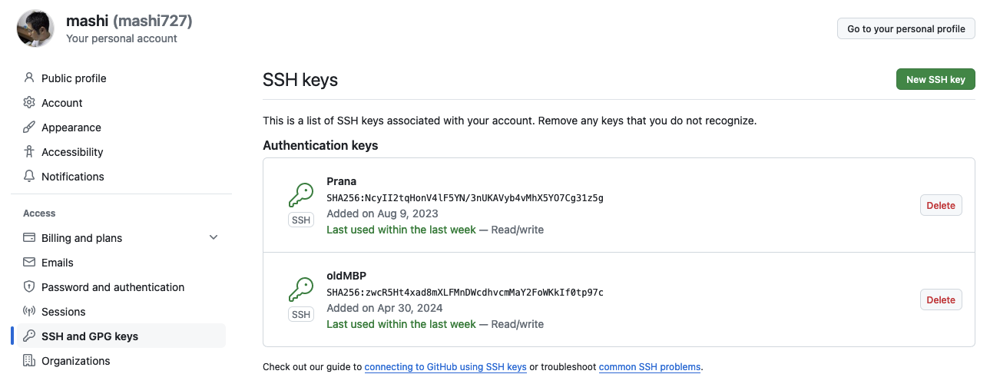

# これは何？

githubでログイン時にログインエラーが出た際の解決方法。

[以下](https://github.com/settings/keys)のページから、

 

- ログインする端末にて、sshのキーを作成
- New SSH Keyから新たなキーを作成
- 作成したキー（pub）をコピーして、該当箇所にペースト
- knownhostsの削除を忘れずに

以上の手順にて問題なくできた。
