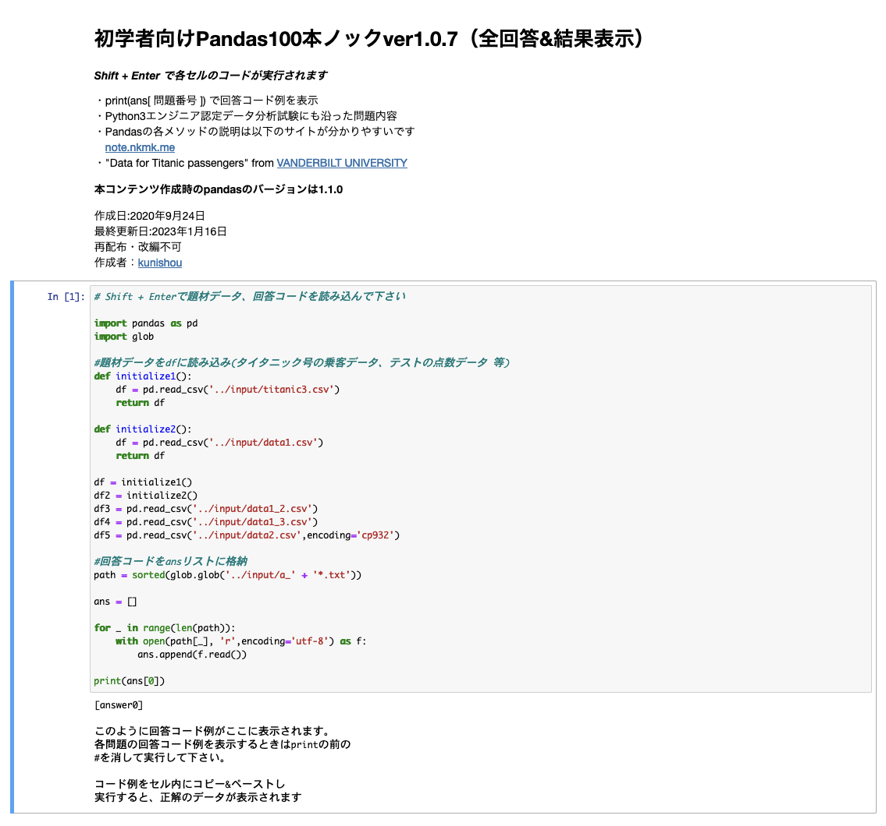

# これは何？

nvimからJupyter notebookを使用する際の覚書です。
おお、IMEの設定はちゃんと動いとるな。


# Python3.12.3のインストールから

Python3.12は、brewからインストール

```sh
brew install python@3.12
```

足りないパッケージをインストールして、設定ファイルを書き換え。

```sh
activate ~/.3.12.3/bin/activate
```

で良いみたい。`zshrc`から読み込むように設定する。

なお`zshenv`にパスを切っていたので、これも変更する。


`jupyter`関連のインストールは、以下の通り。


```sh
pip install notebook nbclassic jupyter-console
```

これで、問題なくできた感じです。


サーバーを起動して、


同期すれば、こんな感じになります。




```sh
Prefix - x
```

でセルが実行されます。

`ipynb`のファイルの変換は、

```sh
❯ foreach i (*.ipynb)
ipynb2jupytext $i
end
```

こんな感じでよろしいかと。
