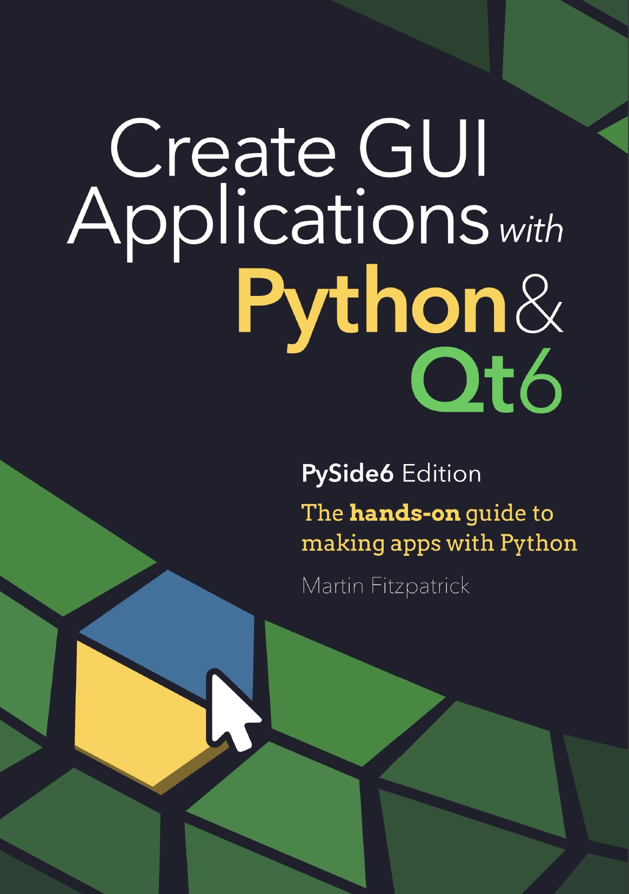
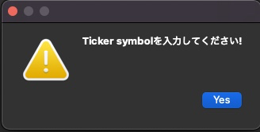

# Today I Done for Backtesting


<!-- @import "[TOC]" {cmd="toc" depthFrom=1 depthTo=6 orderedList=false} -->

# Table Of Contents

<!-- code_chunk_output -->

- [Today I Done for Backtesting](#today-i-done-for-backtesting)
- [Table Of Contents](#table-of-contents)
- [自作ライブラリなどを別ファイルで(2021.10.29)](#自作ライブラリなどを別ファイルで20211029)
- [PySide6への環境移行(2021.10.31)](#pyside6への環境移行20211031)
- [tableView関係のもろもろ](#tableview関係のもろもろ)
  - [dfからmodel, viewを作成](#dfからmodel-viewを作成)
  - [tableViewの列のストレッチ](#tableviewの列のストレッチ)
  - [tableViewで行をダブルクリックして何かさせる](#tableviewで行をダブルクリックして何かさせる)
  - [tableViewで選択したテキストを表示](#tableviewで選択したテキストを表示)
- [Status Barの表示](#status-barの表示)
- [connectに引数を渡す](#connectに引数を渡す)
  - [2021.11.7追加](#2021117追加)
- [MainWindowに所属する変数の宣言](#mainwindowに所属する変数の宣言)
- [オブジェクトの中身をみる](#オブジェクトの中身をみる)
- [Messageの表示](#messageの表示)
- [ticker symbolのサーチの仕様](#ticker-symbolのサーチの仕様)
  - [Nasdaqからfetch](#nasdaqからfetch)
  - [AlphaVantageからfetch](#alphavantageからfetch)
  - [lineEditの挙動の変更](#lineeditの挙動の変更)
- [pyqtgraphを実装](#pyqtgraphを実装)
- [複数のdataframeの最大値](#複数のdataframeの最大値)

<!-- /code_chunk_output -->

# 自作ライブラリなどを別ファイルで(2021.10.29)

これまではひとつのファイルで株価の可視化を進めていましたが、さすがに巨大になり見通しが悪くなってきましたので
Pythonベストプラクティスに従ってライブラリのフォルダ分けを実行しました。

なんか、main.pyがスッキリしてコードを書きやすくなりました。

# PySide6への環境移行(2021.10.31)

PyQt6へ移行しようと思っておりまして…
購入した電子本がこちら。

<p align="center"></p>


しばらく読んでいたのですが、サンプルコードが全てPySide6になってまして、作者のホームページには
両方のコードが例示されているはずのに変だなと不思議に思っておりました。

ということで調べてみると、こちらの本、なんとPyQt6とPySide6のEditionは別になっているとのこと。
改めて表紙をみるとしっかりとPySide6 Editionと書いてありましたよ、ええ。
要は間違えて購入したのですが、これを機にCopyLeftのライセンスのPySideに鞍替えするのもありかなと思い、朝からせっせとPySide6のインストールと書き直しを行っておりました。


# tableView関係のもろもろ

## dfからmodel, viewを作成

```python
class TableModel(QtCore.QAbstractTableModel):
    def __init__(self, data):
        super().__init__()
        self._data = data

    def data(self, index, role):
        if role == Qt.DisplayRole:
            value = self._data.iloc[index.row(), index.column()]
            return str(value)

    def rowCount(self, index):
        return self._data.shape[0]

    def columnCount(self, index):
        return self._data.shape[1]

    def headerData(self, section, orientation, role):
        if role == Qt.DisplayRole:
            if orientation == Qt.Horizontal:
                return str(self._data.columns[section])

            if orientation == Qt.Vertical:
                return str(self._data.index[section])
```

## tableViewの列のストレッチ

結論はこちら。

```python
self.view.horizontalHeader().setStretchLastSection(False)
self.view.horizontalHeader().setSectionResizeMode(0, QtWidgets.QHeaderView.ResizeMode(3)) # 3 -> Resize to contents
self.view.horizontalHeader().setSectionResizeMode(1, QtWidgets.QHeaderView.ResizeMode(1)) # 1 -> stretch
```


いろいろと調べた結果、


https://www.riverbankcomputing.com/static/Docs/PyQt6/api/qtwidgets/qheaderview.html?highlight=setsectionresizemode##setSectionResizeMode


を参考にした。
setStretchLastSection(True)にすると、デフォルトで最終行がストレッチされる。


## tableViewで行をダブルクリックして何かさせる

```python
self.view.doubleClicked.connect(self.get_ticker_symbol)
```


## tableViewで選択したテキストを表示

```python
index = self.view.currentIndex()
NewIndex = self.tableView.model().index(index.row(), 0)     
self.plot_graph(NewIndex.data())
```


# Status Barの表示

MainWIndowに以下のコードを追加するだけ。

```python
# status barの表示
status_bar = self.statusBar() # 下にあるステータスバー
status_bar.showMessage('表示中の銘柄 : ' + str(ticker_symbol)) # 書きたいメッセージ
```


# connectに引数を渡す

lambda関数を使用するのが吉
lambda関数を別に定義したいけど、方法が分からない。
まあ、動くから良いかな。と場当たり的な解決です。

```python
self.pushButton.clicked.connect(lambda: self.plot_graph(self.lineEdit_TickSyml.text()))
```

## 2021.11.7追加

```python
self.tableView.doubleClicked.connect(lambda: self.plot_graph('fetch_4values'))
self.SB_sma_short.valueChanged.connect(lambda: self.plot_graph('sma_update_only'))
self.SB_sma_med.valueChanged.connect(lambda: self.plot_graph('sma_update_only'))
self.SB_sma_long.valueChanged.connect(lambda: self.plot_graph('sma_update_only'))
```

受け側の関数の挙動を変更するために、送り側で挙動のフラグ用のテキストを渡す。
受け側のコードは、以下のとおり。

```python
def plot_graph(self, discriminator):
    if discriminator=='fetch_4values':
        print('Im in fetch_4values!')
        company_data = self.get_ticker_symbol()
        self.df_4values = fetch_4values(company_data, self.comboBox.currentText()) # comboBox.current.Text()は、取得するspan
        if not company_data:
            #pass
            QMessageBox.warning(None, "Notice!", "Ticker symbolを入力してください!", QMessageBox.Yes)
        else:
            # status barの表示
            status_bar = self.statusBar() # 下にあるステータスバー
            status_bar.showMessage('表示中の銘柄 : ' + str(company_data[1])) # 書きたいメッセージ
            df = make_dataframe(self.df_4values, int(self.SB_sma_short.text()), int(self.SB_sma_med.text()), int(self.SB_sma_long.text()))
            last_region = []
            self.plot_stock(df, last_region)
    else:
        print('Im in update sma_values!')
        df = make_dataframe(self.df_4values, int(self.SB_sma_short.text()), int(self.SB_sma_med.text()), int(self.SB_sma_long.text()))
        last_region = [self.minx, self.maxx]
        self.plot_stock(df, last_region)
```


# MainWindowに所属する変数の宣言

以下の中で必要なMainWindowの定数が宣言されてるのでいらないみたい
```python
self.setupUi(self)
```
定義を確認すると、

```python
self.SB_sma_short = QSpinBox(self.centralwidget)
self.SB_sma_short.setObjectName(u"SB_sma_short")
self.SB_sma_short.setMinimumSize(QSize(50, 0))
self.SB_sma_short.setMaximumSize(QSize(50, 16777215))
self.SB_sma_short.setFont(font1)
self.SB_sma_short.setAlignment(Qt.AlignRight|Qt.AlignTrailing|Qt.AlignVCenter)
self.SB_sma_short.setMinimum(1)
self.SB_sma_short.setMaximum(500)
self.SB_sma_short.setValue(5)
self.horizontalLayout_5.addWidget(self.SB_sma_short)
```

とある中の

```python
self.SB_sma_short = QSpinBox(self.centralwidget)
```

が効いているのね。

ということで、

```python
#self.SB_sma_short  = self.SB_sma_short
#self.SB_sma_med  = self.SB_sma_med
#self.SB_sma_long  = self.SB_sma_long
```


# オブジェクトの中身をみる

```python
attributes = dir(OBJECT)
n_max = len(attributes)
for (n, attribute) in enumerate(attributes, start=1):
    pass
    print(f'{n}/{n_max} {attribute}')
```


# Messageの表示

ticker_symbolが未定義だと、メッセージを表示するようにしてみた。
けどもうるさいので、何もしない仕様に変更したよ。

```python
if not ticker_symbol:
    pass
    QMessageBox.warning(None, "Notice!", "Ticker symbolを入力してください!", QMessageBox.Yes)
else:
```

実行すると、以下のメッセージ画面が現れる。

<p align="center"></p>


# ticker symbolのサーチの仕様

## Nasdaqからfetch

## AlphaVantageからfetch

AlphaVantageのAPIを使用して、ticker symbolを取得する仕様を追加。
lineEditの挙動についてtextEditedだとうるさいので、returnPressedに変更
editingFinished（Enterキーを押すか、フィールドがフォーカスを失ったとき）というのも
あるけれども、明示的にreturnを押した方が挙動としては素直だと思ったのでそのように実装。


```python
import requests
from pandas import json_normalize

def search_symbol_alphavantage(ticker_search_keyword):
    # replace the "demo" apikey below with your own key from https://www.alphavantage.co/support/#api-key
    API_KEY='0A5DAC7F3S5UWRJZ'
    SEARCH_KEY = ticker_search_keyword
    url = f'https://www.alphavantage.co/query?function=SYMBOL_SEARCH&keywords={SEARCH_KEY}&apikey=API_KEY'

    r = requests.get(url)
    data = r.json()
    df = json_normalize(data["bestMatches"])
    return df[['1. symbol', '2. name']]
```

## lineEditの挙動の変更

```python
self.lineEdit_TickSyml.returnPressed.connect(self.searchSymbol_from_alphavantage)
```

# pyqtgraphを実装

2021.11.7の時点で、基本チャートの表示まで完成。


# 複数のdataframeの最大値

```python
import pandas as pd

df = pd.DataFrame({
"a": [1, -1, 0, 9, 8, 1, -10],
"b": [-1, 0, 7, 6, 1, 3, 2],
"c": [-1, 0, 11, 6, 1, 3, 2],
"d": [-3, 6, 15, 6, 1, 3, 2]})

print(df[["a","b","c","d"]].max())
# a    9
# b    7
# dtype: int64

print(df[["a","b","c","d"]].max().max())
# 15
```
